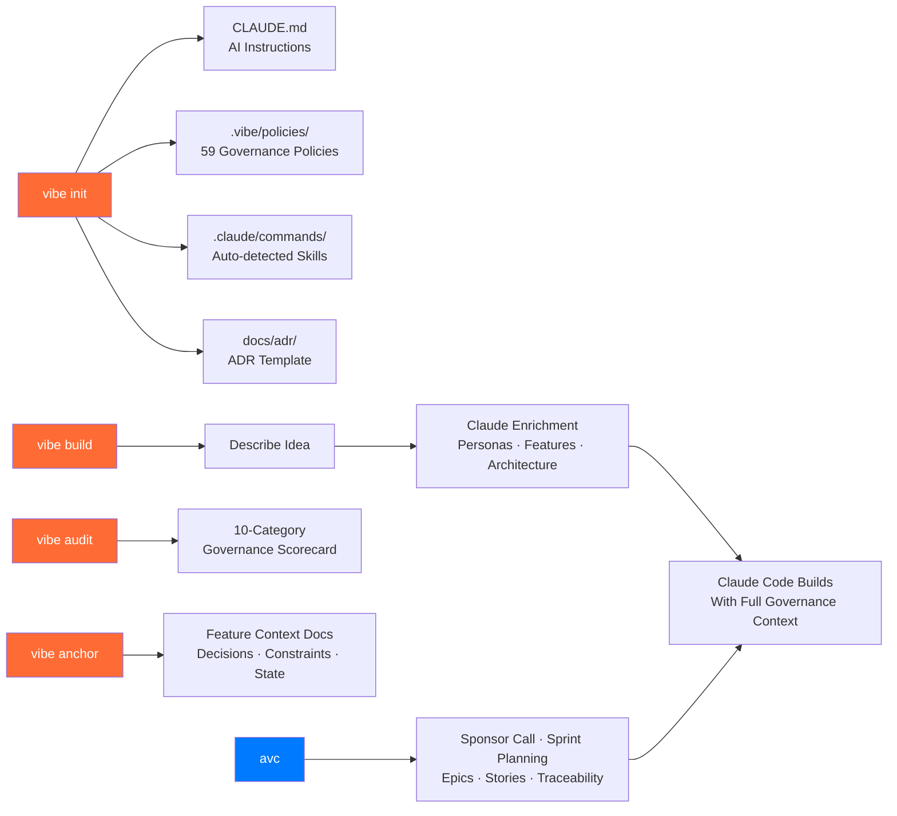
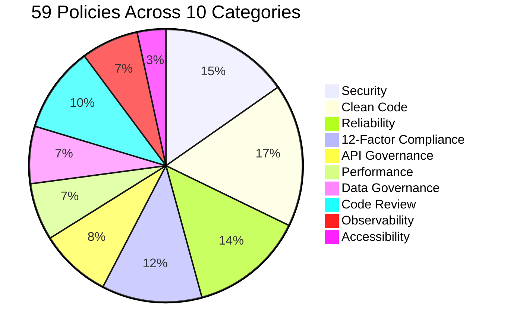
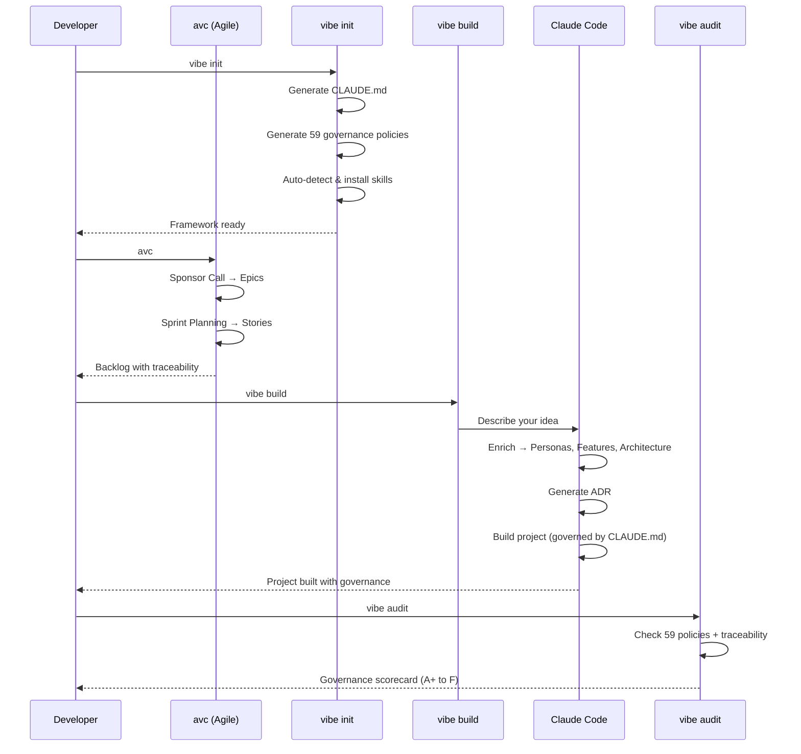
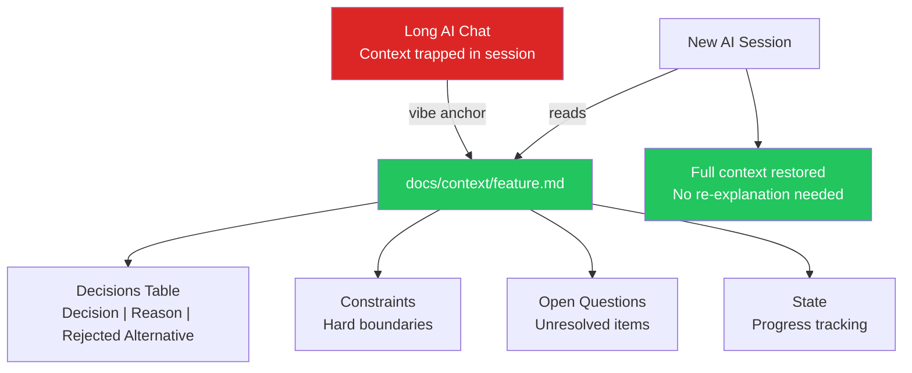
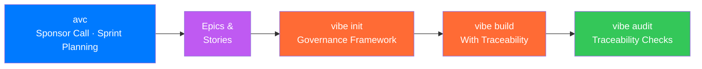
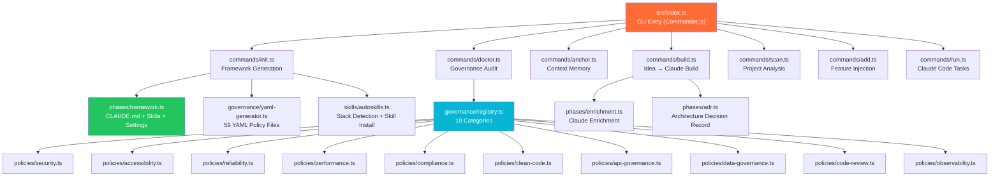

<p align="center">
  
</p>

<h1 align="center">vibe-init-cli</h1>

<p align="center">
  <strong>The software engineering governance engine for AI-assisted coding.</strong><br>
  <sub>59 governance policies. 10 categories. Agile Vibe Coding. Context anchoring. Auto-skills. Powered by Claude.</sub>
</p>

<p align="center">
  <a href="https://github.com/vishalm/vibe-init/actions/workflows/ci.yml"></a>
  <a href="https://www.npmjs.com/package/vibe-init-cli"></a>
  <a href="https://www.npmjs.com/package/vibe-init-cli"></a>
  <a href="https://opensource.org/licenses/MIT"></a>
  <a href="https://nodejs.org"></a>
</p>

<p align="center">
  <a href="https://vishalm.github.io/vibe-init">Documentation</a> · <a href="https://github.com/vishalm/vibe-init">GitHub</a> · <a href="https://github.com/vishalm/vibe-init/issues">Report Bug</a>
</p>

---

## What is vibe-init?

**vibe-init** is a governance-first CLI that prepares any project for successful AI-assisted (vibe) coding. It generates governance policies, coding standards, Claude Code skills, and persistent context anchors — so Claude follows your rules from the first line of code.



---

## Governance at a Glance



| Category | Policies | Severity | What it checks |
|----------|:--------:|----------|---------------|
| **Security** | 9 | block/warn/info | .gitignore, no secrets, env validation, input validation, ORM, lockfile, vuln scanning, auth, SECURITY.md |
| **Clean Code** | 10 | block/warn/info | TS strict, no-any, linter, formatter, git hooks, commits, coverage, console.log, README, CLAUDE.md |
| **Reliability** | 8 | block/warn/info | Health endpoint, CI/CD, tests, graceful shutdown, error boundaries, migrations, E2E, load testing |
| **12-Factor** | 7 | block/warn | VCS, deps, config-in-env, backing services as URLs, port binding, dev/prod parity, logs as streams |
| **API Governance** | 5 | block/warn/info | OpenAPI spec, versioning, rate limiting, input validation, health endpoint |
| **Code Review** | 6 | warn/info | PR templates, CODEOWNERS, issue templates, CONTRIBUTING.md, CHANGELOG, architecture docs |
| **Performance** | 4 | warn/info | Structured logging, bundle analysis, image optimization, containerization |
| **Data Governance** | 4 | warn | Privacy policy, password hashing, SECURITY.md, ORM |
| **Observability** | 4 | warn/info | Logging, tracing (OpenTelemetry), metrics (Prometheus), error tracking (Sentry) |
| **Accessibility** | 2 | warn | a11y linter (eslint-plugin-jsx-a11y), HTML lang attribute |

---

## Install

```bash
npm install -g vibe-init-cli
```

### Prerequisites

| Requirement | Purpose | Required? |
|------------|---------|-----------|
| **Node.js 20+** | Runtime | Yes |
| **Claude CLI** | AI commands (`init`, `build`, `run`, `ask`) | For AI features |
| **ANTHROPIC_API_KEY** | Faster batch generation (falls back to Claude CLI) | Optional |
| **@agile-vibe-coding/avc** | Agile ceremonies (epics, stories, sprint planning) | Optional |

---

## The Vibe Coding Workflow



### Step 1: Prepare the room

```bash
mkdir my-app && cd my-app
vibe init
```

Generates: CLAUDE.md + `.vibe/policies/` (59 YAML policies) + `.claude/commands/` (auto-detected skills) + ADR template + .gitignore

### Step 2: Build from your idea

```bash
vibe build
```

Describe your idea → Claude enriches it (personas, P0/P1/P2 features, architecture) → Claude Code builds it following your governance framework.

### Step 3: Track decisions

```bash
vibe anchor "user authentication"
```

Creates `docs/context/user-authentication.md` with decisions table, constraints, open questions, and state tracking. Context persists across AI sessions.

### Step 4: Check compliance

```bash
vibe audit    # or: vibe doctor
```

10-category governance scorecard with blocking violations, warnings, and quick-fix commands.

---

## Commands

| Command | Description |
|---------|-------------|
| `vibe init` | Set up governance framework (CLAUDE.md, policies, skills, ADR template) |
| `vibe build` | Build a project from your idea with governance context |
| `vibe anchor [feature]` | Create/view feature context anchors for persistent decisions |
| `vibe audit` / `vibe doctor` | Governance compliance audit (59 policies, 10 categories) |
| `vibe scan [dir]` | Analyze project stack and engineering practices |
| `vibe add <feature>` | Inject features: docker, ci, testing, logging, validation, health, hooks, auth, db |
| `vibe run <task>` | Code with Claude using project context |
| `vibe ask <question>` | Read-only advisory from Claude |

---

## Context Anchoring

Based on Martin Fowler's [Context Anchoring](https://martinfowler.com/articles/reduce-friction-ai/context-anchoring.html) pattern.



**Litmus test:** Can you close your AI chat and start fresh without anxiety? If yes, context is anchored.

---

## Agile Vibe Coding Integration

**New in v0.6.0** — Built on the [Agile Vibe Coding Manifesto](https://agilevibecoding.org), vibe-init now integrates with the AVC framework for traceable, accountable AI-assisted development.



### Why Agile Vibe Coding?

> *"Zero traceability of decisions" — that's the exact pain point. Vibe coding ships fast but the governance layer is missing, and that's where production risk accumulates.*

The manifesto's core values:
- **Accountability over anonymous generation** — clear human responsibility for AI output
- **Traceable intent over opaque implementation** — every change links to a requirement
- **Discoverable domain structure over scattered code** — organized around business concepts
- **Human-readable documentation over implicit knowledge** — preserved understanding

### Quick Start with AVC

```bash
# Install AVC
npm install -g @agile-vibe-coding/avc

# Set up governance framework
cd your-project
vibe init

# Run AVC ceremonies
avc
# → Sponsor Call: define epics and priorities
# → Sprint Planning: break epics into stories with acceptance criteria

# Build with full traceability
vibe build
```

### What AVC Adds

| Ceremony | Purpose | Output |
|----------|---------|--------|
| **Sponsor Call** | Define project vision, epics, and priorities | Epics with business context |
| **Sprint Planning** | Break epics into stories, estimate complexity | Sprint backlog with traceability |

Every epic, story, and task created by AVC links back to a requirement — making governance auditable end-to-end.

---

## Auto-Skills

`vibe init` auto-detects your tech stack and installs matching Claude Code skills:

| Detected | Skills installed |
|----------|----------------|
| React | `react-patterns`, `component-design` |
| Next.js | `nextjs-app-router`, `nextjs-server-components` |
| TypeScript | `typescript-strict` |
| Prisma | `prisma-patterns` |
| Tailwind | `tailwind-patterns` |
| Express | `express-patterns` |
| FastAPI | `fastapi-patterns` |
| Vitest | `vitest-testing` |
| Playwright | `playwright-e2e` |
| Docker | `docker-patterns` |

Plus universal skills: `/anchor` (context memory) and `/governance` (audit check).

Integration with [autoskills](https://github.com/vishalm/ai-skills-autoskills) for community skill registry.

---

## Governance Policy Format

Policies are generated as YAML files compatible with [Microsoft Agent Governance Toolkit](https://github.com/microsoft/agent-governance-toolkit):

```yaml
# .vibe/policies/security.yaml
category: "security"
conflict_resolution: "deny_overrides"

rules:
  - name: "sec-001"
    display_name: "Gitignore excludes .env"
    severity: "block"
    action: "deny"
    references:
      - "https://owasp.org/Top10/A07_2021"
```

Three severity levels:
- **block** — mandatory, must fix before shipping
- **warn** — should fix, impacts quality
- **info** — nice to have, best practice

---

## Project Architecture



---

## Development

```bash
git clone https://github.com/vishalm/vibe-init.git
cd vibe-init
npm install

npm run build          # Build with esbuild
npm run lint           # TypeScript type check
npm run test           # Run all 103 tests
npm run prerelease     # Full pre-release checks
npm run dev            # Watch mode
```

## Contributing

1. Fork the repository
2. Create a feature branch (`git checkout -b feat/amazing-feature`)
3. Commit with [conventional commits](https://www.conventionalcommits.org/)
4. Push and open a Pull Request

## License

[MIT](LICENSE)

---

<p align="center">
  Built by <a href="https://github.com/vishalm">Vishal Mishra</a> with <a href="https://claude.ai">Claude</a><br>
  <sub>The software engineering governance engine.</sub>
</p>
